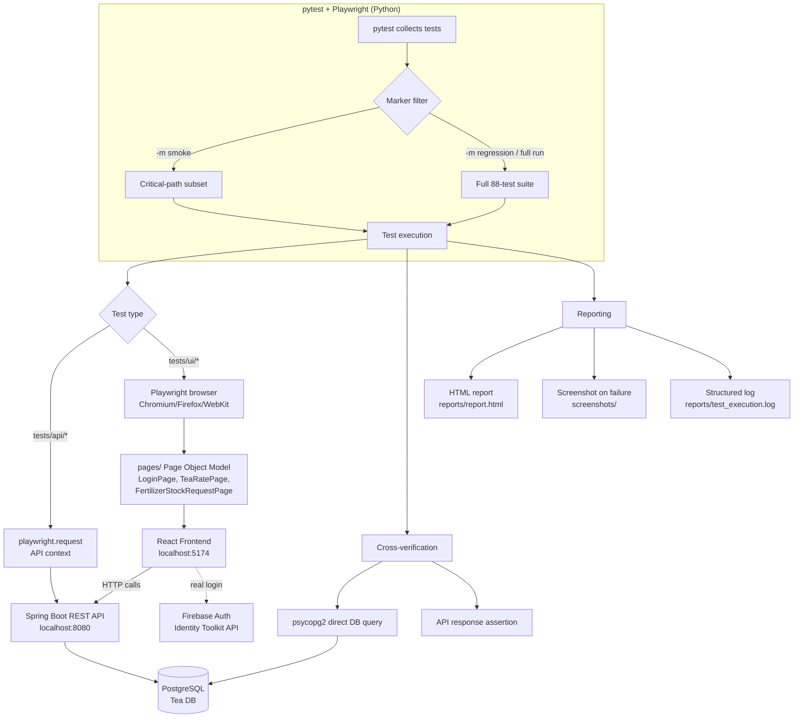
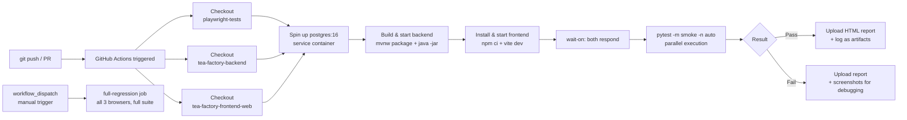
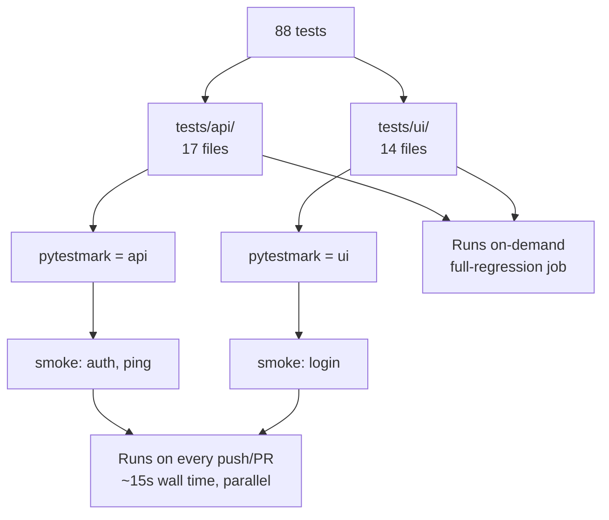

# Testing Architecture — Visual Overview

Two diagrams for the interview: how a single test run flows through the
stack, and how CI/CD automates that same flow on every push.

## 1. Test Execution Flow

**Key point for the interview:** tests don't just trust the UI or the API in
isolation — a UI test that submits a form (e.g. Tea Rate) is cross-verified
against the database or the API afterward, because a frontend can show a
fake success message even when the backend call silently failed.

## 2. CI/CD Pipeline (GitHub Actions)

**Key point for the interview:** backend, frontend, and this test suite are
three separate GitHub repos (not a monorepo), so the pipeline checks each
one out independently and lays them out as siblings on the runner before
building anything.

## 3. Test Organization Summary

